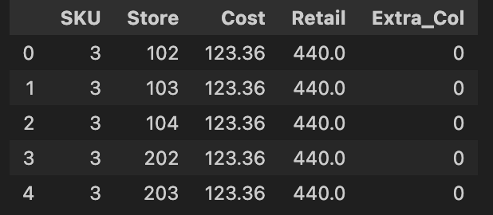
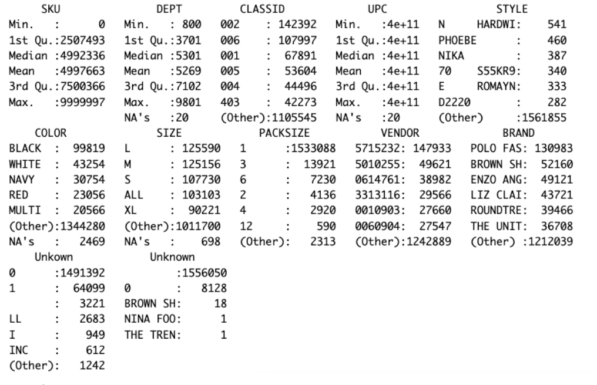
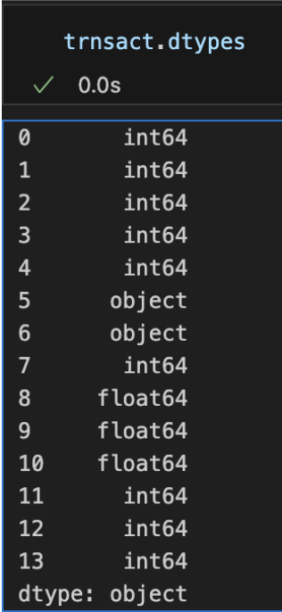
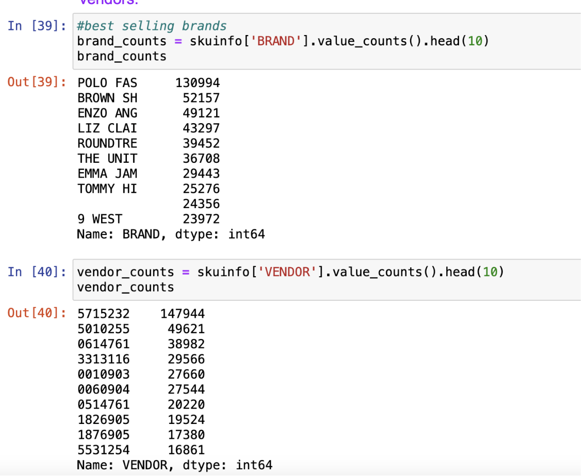

# 400Project - Group 8 

# Week1:10.9-10.13

## Description:
Dillard’s is a major retail chain with several stores. Dillard’s has point-of-sales (POS) data over a period of time in 2004 and 2005 that includes their store information, stock-keeping-unit (SKU), and transactions. Over the recorded times, around half of all transactions happen with some discounts. The MLDS team believes that it would be beneficial to understand which components (product’s features, location, time of the year, etc.) contribute to the need to offer discounts within transactions.

Understanding the mechanics of transactions with discounts will allow Dillard’s to increase the production rate for products that can be sold without a discount. Moreover, Dillard’s can also accurately predict future revenue by predicting the discount (reduction of sales price).

## Findings and Analysis:
Data size below:
Deptinfo: 59
Skstino: 39230146
Skuinfo: 1564177
Strinfo: 452
Transact: 120916896

Skstino:
First, I used python to explore the dataset.
Skstinfo_df.shape == (39230146, 5)
There are 39230146 rows and 5 columns. However the Sktino dataset has not have column names, thus I check the data type for each column, with 2 floating and 3 int data type. According the data schema, I signed new column names for the dataset as below.
Skstinfo_df.columns =['SKU','Store','Cost','Retail','Extra_Col']

Skuinfo:
There are 1,564,198 observations and 12 variables in the Skuinfo dataset. However, the last two variables are unknown variables (I named them "Unknown"), which contain numbers and text. For irrelevant variables, we decided to delete them.
Other variables in this dataset, such as "STYLE", "SIZE", which are purely numeric, purely textual, or a combination of numeric, textual, and symbolic, will need to be cleaned up and categorized in depth for further discussion.
Some numeric variables such as "DEPT", "UPC", "COLOR", "SIZE ", all of which contain unknown values, need to be cleaned up.
This is the summary of the Skuinfo dataset.

Transact:
The transactions dataset is the largest one out of the 5 datasets, it contains 120,916,896 million observations and 14 features. According to the database schema there are only 12 features in the transactions table. Therefore, for next week we are planning to delve deeper into the dataset to clean the data before we perform any further analysis.

Strinfo and deptinfo dataset:
Cleaned and did basic data analysis for strinfo and  deptinfo. We found that the top 3 states that have the most stores are Texas, Florida, and Arizona. The top cities that have the highest number of  stores are LITTLE ROCK,GILBERT, SAN ANTONIO,OLATHE and HOUSTON.

Ideas drafted for the first week(which need further discussion):
1. Can we predict customer purchase behavior based on transaction data including variables such as transaction amount (AMT), brand (BRAND), stock item classification (CLASSID), color (COLOR), cost (COST), department (DEPT), original price (ORGPRICE), quantity (QUANTITY), retail price (RETAIL), sale date (SALEDATE), size (SIZE), and other relevant factors
2. Can we optimize pricing and inventory management in retail stores by analyzing historical transaction data
including variables like transaction amount (AMT), retail price (RETAIL), sale date (SALEDATE), department (DEPT), and brand (BRAND)
3. In a CITY, there are different ZIPs, what is the effect of different ZIPs on COST? There may be some cities where the COST is higher, but the COST is lower in the suburban areas of the CITY. What is the effect of different ZIPs in different CITYs on COST?
4. Is there any relationship between CLASSID and COST? Is it that the higher the CLASS, the higher the COST? Also we need to control variables, for example, compare the relationship between CLASSID and COST under one same ZIP.
5. What is the relationship between PACKSIZE, RETAIL and QUANTITY? Is it that the larger the PACKSIZE, the smaller the RETAIL per unit? Because a large PACKSIZE indicates that a wholesale, such as Costco, can have lower prices for one unit, then isn't it true that QUANTITY will be larger? Because it's cheaper
6. What is the relationship between SIZE, COST, and RETAIL? A larger SIZE will have more COST, but a larger SIZE does not necessarily have a larger RETAIL
What is the relationship between SALEDATE and QUANTITY? Some products are seasonal and some can be sold year round. Determine what product it is based on the change in QUANTITY over the year
7. Can placing products with high QUANTITY, large RETAIL, and small SIZE in areas where people have high purchasing potential make it easier for them to buy them, and will this promote greater sales? Can cost and price be reduced by placing products with low QUANTITY, small RETAIL and large SIZE in remote areas?
8. Are there relationships between CITY, STYLE, and COLOR? Do different cities have different preferences?

Research Questions with team: 
Which item has the highest vs. lowest sales 
Which color from the items is in fashion? 
For that we will look at the highest sales or biggest production quantity. 
How much inventory is left or how much demand there is for certain products
We could do an analysis to see what affects demand for specific products (e.g. top 5) and predict if there is enough inventory to cover future demand. 
If not enough inventory we could make a suggestion of how much more needs to be produced. 
Or  which other products that have less demand we can supply less of, so we  can instead cover future demand shortages for the products that have higher demand. 
We can look and see which states have higher sales as well as which states. In addition to that we can look and see whether demand is met better in the states that have inventory locations.  

## Plans for Next Week:
Delve deeper into the dataset to clean the data before performing any further analysis.
Learn how to use Postgres, and create tables.

# Week1:10.16-10.20

# Work completed 
Attempted to load all data tables from the schema on postgres. 
    - Our attempts were successful for the sksinfo, strinfo and deptinfo tables         the remaining tables our attempts failed.
    - We faced issues with uploading the transactions and sku tables so we decided       to cross check each column from the schema and clean the data first in order       to be able to load them in postgres. 
    
1.Trnsact.csv:
  - We used Python to analyze the data and cross check the different features that     are listed in the schema. 
  - We checked each feature’s data type, and we found: 
    
        a.Two objects in the transaction table: index[5] is sale date according            to the schema, but its data type should be encoded as date time or               text. Index[6] appears as a character variable in the table, taking              values “P” and “R”, thus should be encoded as a character data type.
        b.We have three variables with floating data types: AMT, Orgprice and one           more.
        c.We identified the following index columns and assigned the appropriate            column names:
            i.Index[0] =Sku, we compared the mean value from the Sku table with                 the Transaction table and determined that index[0] is the SKU                     feature.
            ii.Index[1] = store. We validated that index[1] is the same as the                    first column from the Strinfo table.
            iii.Index[2] = register. 
            iv. Index[3] = transaction number.
            v. Index[5] = SaleDate. It was the only column with a date according                 to the column/attribute description table. However, we noticed                   that its data type was “object” but it  should be encoded as                     date time or text instead.
            vi.Index[6] = Stype. It appears as a character variable in the table,                taking values “P” and “R”, thus should be encoded as a character                  data type.
            vii.Index[7] = Quantity. We checked the descriptive statistics and                   the result(min,max,and mean) matches with the column/attribute                   description table.
            viii.Index[13] =  unknown. This column did not match any of the                       features in the schema and all the values within it equal to 0.
            ix.Index[8] = AMT. There are 3 floating data type columns. Columns                   with Index[9] and [10] were almost the same, only 7 observations                 were different. The difference among these 2 columns was not                     significant so we decided to drop one of the columns and name                    the other AMT.
             x.Index[9] = OriginalPrice. There is one floating column left which                 the max number of integers matches the Original price feature                    from the schema. We decided which column to assign to the AMT                    feature by comparing the prices between each SKU and using common                 sense and assuming that the sale price could not be higher than                  the original price.
             xi.Index[4] and index[11] should be in between: SEQ and InterID (9                  digits). We were not able to identify which column was                          attributed to which variable. 
             xii.Index[12] = MIC. We attributed this column to be MIC based on                    the schema because the maximum number of digits was 3.
             
2.Skuinfo.csv: 
  - Cleaned the dataset:
      a. Removed unrelated 3 last columns.
      b. Replace all empty values, N/A, NA with NaN.
      c. Remove any rows with missing values.
      d. Cleaned rows with non-numeric PACKSIZE values.
      e. Filter rows with only numeric values in CLASSID.
      
  - Checked the dataset: 
      a. Treat SKU and UPC as item IDs since they are unique to each observation.
      b. Deleted SIZE and STYLE columns since they are useless and messy.
  - After careful discussion, we cleaned all of the na values and encoded typos      and managed consistency on columns ‘size’, ‘classid’, ‘sku’. 
  - We used python to read in the file, deep cleaned the file with string methods     to correct messy syntaxes in the original csv file. 
  - We also did a brief analysis ofthe most popular brands and vendors. 
    
  - As a result: 
      a. Type of SKU is integer
      b. Type of DEPT is integer
      c. Type of CLASSID is factor
      d. Type of UPC is numeric
      e. Type of COLOR is factor
      f. Type of PACKSIZE is numeric
      g. Type of VENDOR is factor
      h. Type of BRAND is factor

# Work planned 10/20 - 10/27:
  - Continue cleaning the data in the SKU and transactions tables. 
  - Attempt to load the remaining 2 datasets that we repeatedly failed to load in     postgres. 
  - Continue to learn how to use Postgres. 
  - Consider questions to explore.

    

             
             
             

            
            

